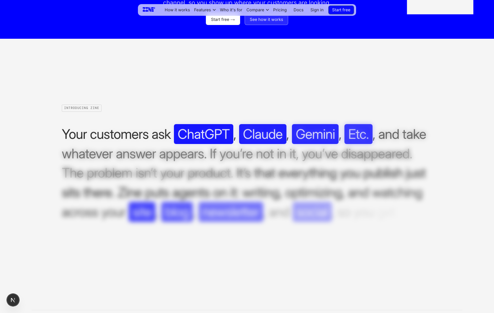

# adam-plugins

Personal plugin marketplace by Adam Perlis. The repo is public so the same skill packages can be installed in Claude Code and, where supported, OpenAI/Codex plugin surfaces.

## Install

### Claude Code

```bash
claude plugin marketplace add adamperlis/adam-plugins
claude plugin install social-video@adam-plugins
claude plugin install ui-motion@adam-plugins
```

### Codex / ChatGPT Desktop

```bash
codex plugin marketplace add adamperlis/adam-plugins
```

Then open the Plugins Directory and install `ui-motion` from the `Adam Plugins` marketplace.

The `ui-motion` plugin includes both portable OpenAI packaging and compatibility manifests:

- `plugins/ui-motion/plugin.json` for portable Agent Plugins / OpenAI-compatible hosts.
- `plugins/ui-motion/.codex-plugin/plugin.json` as a Codex compatibility fallback.
- `plugins/ui-motion/.claude-plugin/plugin.json` for Claude Code.
- `.agents/plugins/marketplace.json` for Codex / ChatGPT desktop marketplace discovery.
- `.claude-plugin/marketplace.json` for Claude-compatible marketplace discovery.

## Plugins

| Plugin | Contents | What it does |
|---|---|---|
| `social-video` | skill: `social-video-hooks` | Writes briefs, scripts, and shot lists for short-form social video. |
| `ui-motion` | skills: `kinetic-inflated-hero`, `scroll-blur-manifesto` | Builds high-taste kinetic typography heroes and scroll-linked blur manifesto transitions. |

## UI Motion

The `ui-motion` plugin is for front-end work where the motion idea is the product story, not decoration. It packages two reusable UI skills extracted from the Zine homepage direction.

### `kinetic-inflated-hero`

Use this when you want a full-viewport hero built around living typography: inflated letters, soft-body motion, Matter.js-style collisions, Pretext-inspired kinetic type behavior, SVG goo/blur filters, and a signature word effect.


Good requests:

```text
Use $kinetic-inflated-hero to design a full-screen launch hero for an AI visibility product. Make the main visual inflated physical type, not a dashboard screenshot.
```

```text
Use $kinetic-inflated-hero to implement a hero where the word "invisible" blurs and disappears letter-by-letter, then resolves back into focus.
```

### `scroll-blur-manifesto`

Use this for the section immediately after a loud hero: a quiet editorial argument that resolves from blurred ghost text into sharp copy as the user scrolls. It is especially useful for Lenis + GSAP ScrollTrigger builds.



Good requests:

```text
Use $scroll-blur-manifesto to build a Lightfield-style manifesto section where each word appears as a blurred ghost before sharpening on scroll.
```

```text
Use $scroll-blur-manifesto after the hero. Keep it warm, editorial, and restrained; use sharp and pre-blurred text layers instead of animating blur on every word.
```

## Layout

```text
.claude-plugin/marketplace.json     # Claude-compatible marketplace manifest
.agents/plugins/marketplace.json    # Codex / ChatGPT desktop marketplace manifest
plugins/<plugin>/
  plugin.json                       # portable OpenAI / Agent Plugins manifest
  .codex-plugin/plugin.json         # Codex compatibility manifest
  .claude-plugin/plugin.json        # Claude plugin manifest
  skills/<skill>/SKILL.md           # skill instructions
  assets/                           # plugin-level screenshots/reference images
```
