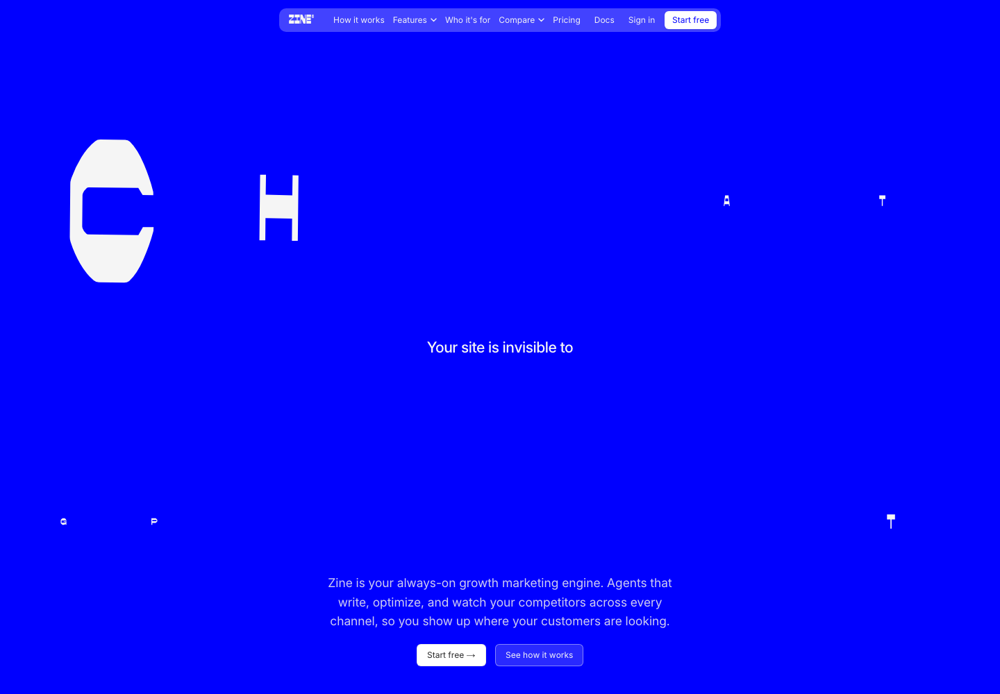
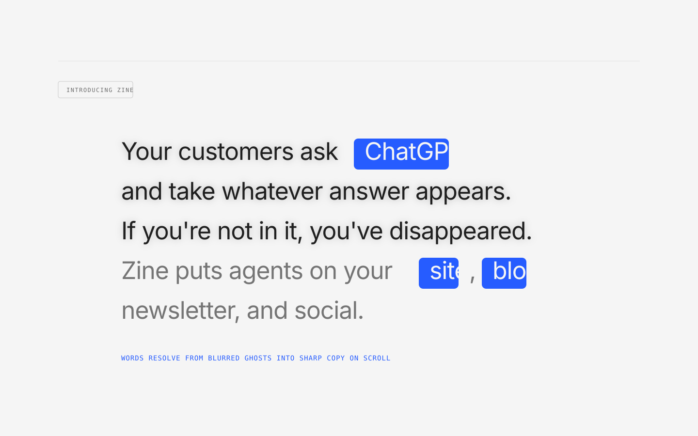

# ui-motion

`ui-motion` is a small cross-agent plugin for high-taste front-end motion patterns. It is packaged for Claude Code and for OpenAI/Codex-compatible plugin hosts.

It contains two skills:

| Skill | Use it for | Primary tools |
|---|---|---|
| `kinetic-inflated-hero` | Full-screen kinetic typography heroes with inflated physical letterforms. | React/Next.js, Matter.js-style physics, Pretext-inspired typography, SVG goo/blur filters, CSS keyframes |
| `scroll-blur-manifesto` | Quiet editorial sections where text resolves from blur into clarity on scroll. | Lenis, GSAP ScrollTrigger, layered sharp + pre-blurred text, opacity crossfades |

## Kinetic Inflated Hero

This skill helps create a hero that behaves like a kinetic brand object. Use it when a normal SaaS headline plus screenshot would feel too generic.



It guides the agent to:

- use a full-viewport composition
- make inflated letterforms the main visual system
- treat support copy and CTAs as obstacles the letters avoid
- preserve legibility while keeping the type alive
- use a signature per-letter blur/disappear/refocus effect for important words such as “invisible”
- avoid generic AI sparkles, dashboard mockups, and purple gradients

Example prompt:

```text
Use $kinetic-inflated-hero to design and implement a launch hero for Zine. The phrase is “Your site is invisible to ChatGPT, Claude, Gemini, Perplexity, Grok.” Make the word “invisible” defocus and vanish letter-by-letter, then resolve back into focus.
```

## Scroll Blur Manifesto

This skill helps build the calmer section after a loud hero: the product argument becomes readable as the user scrolls.



It guides the agent to:

- use a warm near-white editorial canvas
- render one large left-aligned manifesto paragraph
- highlight key words as electric-blue filled pills
- use Lenis + GSAP ScrollTrigger for scroll-scrubbed motion
- reveal text through a sharp layer and a pre-blurred ghost layer
- animate opacity between layers instead of animating blur on many words
- preserve readable static text for crawlers, screen readers, and reduced-motion users

Example prompt:

```text
Use $scroll-blur-manifesto to build the section after my hero. The section should start with “Introducing Zine,” then reveal a large manifesto paragraph word-by-word. Each word should appear blurred first, hold briefly, then sharpen as I scroll.
```

## Packaging

- `plugin.json` is the portable Agent Plugins manifest for OpenAI/Codex-compatible hosts.
- `.codex-plugin/plugin.json` is the Codex compatibility fallback and declares `skills: ./skills/`.
- `.claude-plugin/plugin.json` keeps the same plugin installable in Claude Code.
- Skill files live in `skills/<skill>/SKILL.md`.
- Reference images live in `assets/` and are also copied into skill-specific `assets/` folders when useful.
