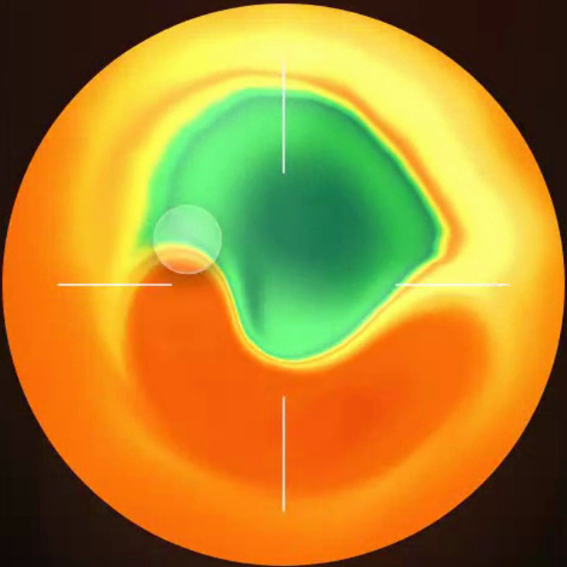

# UI Motion

Three reusable frontend skills for kinetic hero typography, scroll-driven text reveals and a touch-reactive thermal shader, available for Claude Code and Codex.

**[Try the live interactive demo](https://adamperlis.github.io/adam-plugins/plugins/ui-motion/examples/contained-ui-motion-demo.html)** — explore the hero and the scroll reveal, adjust the DialKit controls, and copy a component with your settings.

**[Try the thermal finger trail](https://adamperlis.github.io/adam-plugins/plugins/ui-motion/examples/thermal-finger-trail-demo.html)** — drag across the disc, press to ripple, tune every constant in DialKit, and copy it.

## Install The Pack

For the full frontend pack, install `frontend-design-director` first for page-wide direction, then `ui-motion` for the motion patterns below. `design-constraints` is an optional companion for tighter layouts. These plugins can also be used independently.

**Claude Code**

```bash
claude plugin marketplace add adamperlis/adam-plugins
claude plugin install frontend-design-director@adam-plugins
claude plugin install ui-motion@adam-plugins
```

**Codex**

```bash
codex plugin marketplace add adamperlis/adam-plugins
```

Then install `frontend-design-director` and `ui-motion` from the Plugins Directory. Ask for both in the same task when you want the page-wide design direction and one of these specific effects.

It contains three skills:

| Skill | Use it for | Primary tools |
|---|---|---|
| `kinetic-inflated-hero` | Full-screen kinetic typography heroes with inflated physical letterforms. | React/Next.js, Matter.js-style physics, Pretext-inspired typography, SVG goo/blur filters, CSS keyframes |
| `scroll-blur-manifesto` | Quiet editorial sections where text resolves from blur into clarity on scroll. | Lenis, GSAP ScrollTrigger, layered sharp + pre-blurred text, opacity crossfades |
| `thermal-finger-trail` | A heat-camera field a finger smears like wet paint: a trackpad, a touch surface, a hero object to play with. | WebGL fragment shader, domain-warped fbm, pointer trail as uniforms, DialKit |

## Contained Code Example

The [live demo](https://adamperlis.github.io/adam-plugins/plugins/ui-motion/examples/contained-ui-motion-demo.html) is a single-file HTML/CSS/JS example. You can also [view its source](examples/contained-ui-motion-demo.html). It includes:

- an electric-blue kinetic inflated hero whose letters fit measured space around the nav, statement, and bottom copy
- a per-letter invisible-word blur/refocus effect
- a warm editorial scroll section
- sharp and pre-blurred text layers that crossfade on scroll
- separate Hero and Section reveal panels using real DialKit, with saved values and presets
- Matter.js hover collision with sharp letters, timed letter pops, and a synchronized one-shot "invisible" wash
- a `Copy component` action in each DialKit panel that copies a standalone example for that section with the current settings embedded
- CDN-loaded Matter.js, DialKit, Lenis, GSAP, and ScrollTrigger
- a reduced-motion fallback

The real Zine implementation uses Next.js, React, Matter.js, `opentype.js`, Lenis, GSAP ScrollTrigger, and local fonts loaded with `next/font/local`: Geist, Fragment Mono, Inter, DM Mono, and OT2049 for the inflated hero glyphs. The contained demo loads OT2049 Bold from a sibling `Zine` checkout for local preview. The hosted example uses the open-licensed Bricolage Grotesque fallback; it does not redistribute OT2049. Before using the copied hero code in another project, replace the `@font-face` URL with a licensed font asset you can serve there. The demo uses Matter bodies, measured obstacle pockets, and hover scaling, while production Zine deforms actual font outlines through a particle lattice.

## Invoking These Skills

Claude Code and Codex use different explicit skill syntax:

| Host | Kinetic hero | Scroll blur manifesto | Thermal finger trail |
|---|---|---|---|
| Claude Code | `/kinetic-inflated-hero` | `/scroll-blur-manifesto` | `/thermal-finger-trail` |
| Codex | `$kinetic-inflated-hero` | `$scroll-blur-manifesto` | `$thermal-finger-trail` |

Plain language also works in many clients, but explicit examples are clearer when you know where the skill is installed.

## Kinetic Inflated Hero

This skill helps create a hero that behaves like a kinetic brand object. Use it when a normal SaaS headline plus screenshot would feel too generic.


It guides the agent to:

- use a full-viewport composition
- make inflated letterforms the main visual system
- treat support copy and CTAs as obstacles the letters avoid
- preserve legibility while keeping the type alive
- use a signature per-letter blur/disappear/refocus effect for important words such as “invisible”
- avoid generic AI sparkles, dashboard mockups, and purple gradients

Example prompts:

**Claude Code**

> /kinetic-inflated-hero design and implement a launch hero for Zine. The phrase is “Your site is invisible to ChatGPT, Claude, Gemini, Perplexity, Grok.” Make the word “invisible” defocus and vanish letter-by-letter, then resolve back into focus.

**Codex**

> $kinetic-inflated-hero design and implement a launch hero for Zine. The phrase is “Your site is invisible to ChatGPT, Claude, Gemini, Perplexity, Grok.” Make the word “invisible” defocus and vanish letter-by-letter, then resolve back into focus.

## Scroll Blur Manifesto

This skill helps build the calmer section after a loud hero: the product argument becomes readable as the user scrolls.


It guides the agent to:

- use a warm near-white editorial canvas
- render one large left-aligned manifesto paragraph
- highlight key words as electric-blue filled pills
- use Lenis + GSAP ScrollTrigger for scroll-scrubbed motion
- reveal text through a sharp layer and a pre-blurred ghost layer
- animate opacity between layers instead of animating blur on many words
- preserve readable static text for crawlers, screen readers, and reduced-motion users

Example prompts:

**Claude Code**

> /scroll-blur-manifesto build the section after my hero. Start with “Introducing Zine,” then reveal a large manifesto paragraph word-by-word. Each word should appear blurred first, hold briefly, then sharpen as I scroll.

**Codex**

> $scroll-blur-manifesto build the section after my hero. Start with “Introducing Zine,” then reveal a large manifesto paragraph word-by-word. Each word should appear blurred first, hold briefly, then sharpen as I scroll.

## Thermal Finger Trail

A heat-camera field you can touch. Drag a finger across it and the heat is dragged along with you, like a fingertip through wet paint, then it slowly heals. Press, and a ripple pushes the colour outward and briefly heats it. It's the trackpad disc from Clicker, [B150](https://b150.ai)'s app that turns an iPhone into a trackpad. On Clicker's site the disc *is* the product: the place your finger goes.



**[Try it](https://adamperlis.github.io/adam-plugins/plugins/ui-motion/examples/thermal-finger-trail-demo.html)** · [view the source](examples/thermal-finger-trail-demo.html)

### How we built it

It's one fragment shader on one full-canvas triangle. There are no textures, no render targets and no simulation.

1. **The field is noise, warped twice.** Fractal noise bends the coordinates, then a second layer of noise, fed by the first, bends them again. That "warp the warp" gives the slow, curling, fluid look. A six-second *melt* cycle swells the warp and lets the shape slump, then recovers.
2. **A blob breathes in it.** In that warped space sits a soft blob whose edge wobbles on two slow sines. Heat comes from where you are relative to it. Outside is a warm, noisy background. Inside ramps from a cool core to a hot rim, with a hard contour cut where green meets yellow so the core reads crisp.
3. **Heat becomes colour through a ramp.** A heat value from 0 to 1 runs through seven colours (cold teal, deep teal, green, yellow, orange, red, white) with smooth blends between them. It's capped at 0.75, so the hottest it gets is orange-red, never blown-out white. That one cap is most of why it looks like a thermal camera and not a lava lamp.
4. **The finger is just a list of points.** JavaScript keeps the last 24 points of your path. Each one stores where it was, the direction and speed you were moving there, and an age that fades over 1.6 seconds. Every frame they go to the shader as uniforms, and each point within reach shifts the coordinates along its own velocity. So the field is drawn from *where your finger came from*, and the colour looks dragged. As the points age out, it relaxes back.
5. **Smoothing makes it feel like paint, not glitch.** The trail follows a head that eases 30% of the way to your finger each frame. New points are laid by distance travelled, not by time. Without that, a fast flick becomes one giant jump that tears a hard-edged hole in the field.
6. **The edge has a life of its own.** By default the blob's edge is razor-crisp. Every so often a soft blur front sweeps across the disc from a slowly turning direction, then recedes. On top sit a thin bright rim just inside the edge and a warm halo just outside.

It's a heavy shader, about 30 noise lookups a pixel. So the demo renders to a fixed pixel budget and lets the browser scale it up, which doesn't show on a soft field. It drops resolution further if frames run long, and stops drawing when it's offscreen. With reduced motion, the field holds still and only your finger moves it.

### Copy it

The demo is a single HTML file with a [DialKit](https://github.com/joshpuckett/dialkit) panel (bottom right). Every constant from the original is a control: smudge strength, reach, follow, trail life, flow, melt, warp, blob size, the blur wash, the heat cap, the press ripple, the rim and halo, and all seven palette colours. Choose disc or full-bleed. **Copy component** puts a standalone file on your clipboard with your settings baked in.

Example prompts:

**Claude Code**

> /thermal-finger-trail build a trackpad hero for my app: a thermal disc a visitor can drag across, with a press ripple. Use our brand's colours for the heat ramp.

**Codex**

> $thermal-finger-trail make the hero object a heat-camera field that reacts to touch, full-bleed on mobile, with reduced-motion support.

## Packaging

- `plugin.json` is the portable Agent Plugins manifest for OpenAI/Codex-compatible hosts.
- `.codex-plugin/plugin.json` is the Codex compatibility fallback and declares `skills: ./skills/`.
- `.claude-plugin/plugin.json` keeps the same plugin installable in Claude Code.
- Skill files live in `skills/<skill>/SKILL.md`.
- Reference images live in `assets/` and are also copied into skill-specific `assets/` folders when useful.
- `skills/thermal-finger-trail/references/thermal-finger-trail.html` is a copy of `examples/thermal-finger-trail-demo.html`, so the skill works on its own once installed. Update both together.
